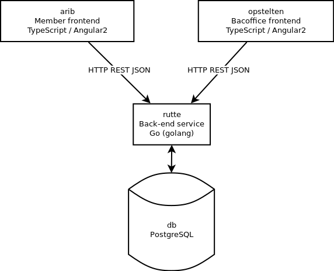

## stem

### Simple overview of components

This projects now consists of 4 main components:
 - `db`: The central database.
 - `rutte`: The back-end program exposing REST API's for two front-ends:
 - `arib`: The front-end for party members (member self-service, voting and discussion).
 - `opstelten`: The front-end for GeenPeil HQ personnel.

To get started, read the README's of individual components in order as listed above.

### I would like to participate

Awesome! Go to [Projects](https://github.com/GeenPeil/stem/projects) to find yourself a suiting task to complete. Make sure the task is in a "TODO" column and not already assigned.

Once you've found a task you are willing to take on it's important to assign yourself to this task so we know you are working on it and move it to the "In Progress" column. Create a fork of the repository. Create a new branch on your fork and push your masterpiece. Once complete, back to GitHub to create a pull request. 

After someone else reviewed/approved your code it will be merged back into the master branch.

If you are unable to or have no time to complete a task which you assigned to yourself be sure to put it back into the TODO list so someone else can pick it up. Perhaps you can add a comment pointing to a work-in-progress branch someone else can adopt.

Thanks for joining the project!
